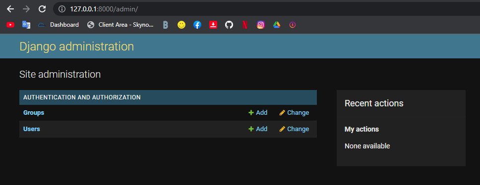
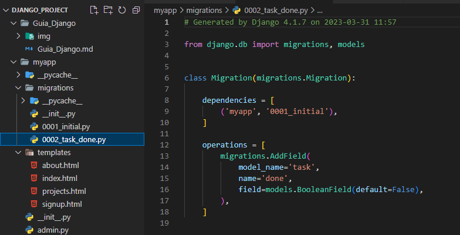

# Guia de Django

dajngo es un famework opensourd para leer archivos crear formularios.

## Empezar a utilizarlo

tenemos que tener python y pip. Al instalar python se instalara automaticamente el pip.

Utilzaremos CMD

    python --version

~~~
pip --version
~~~
___
Ahora tenemos que crear un entorno virtual para cada uno de nuestros proyectos.
Basicamente creamos una carpta y ellí instalamos todo lo que necesitemos como python, pip, modulos, dependencias, etc.

Para ello nos ubicamos en la carpeta de nuestro proyecto y crearemos el entorno virtual llamado `virtualenv`. Este en un modulo de pip

    pip install viertualenv

ahora crearemos una carpeta llamada venv. Ahí estará nuestro proyecto

    virtualenv venv

### Activamos la virtualización

Ahora activamos el entorno virtal ejecutando el archivo activate que se genero en la carpeta venv.

La consola estara asi, con el venv `(venv) E:\_TALLER_\django_project>`

    .\venv\Scripts\activate
   
Ahora con el entono virtual activado podremos instalar modulos solo en la carpeta de nuestro proyecto y no el systema de nuestra PC

## Instalar Django

Ahora insrtalare Djando en mi entorno virtual.

    pip install django

Para conprovar que ya tengo django hago esto.

~~~
python -m django --version
~~~

    django-admin --version

~~~
python
import django
django.get_version()

exit()
~~~

## Crear Proyecto de Django

Crear un proyecto. Es importante no utilizar nombres relacionados con django o admin ya que puede genera errores con la nomenclatura del modulo django. Yo utilizare `mysite`

    django-admin startproject mysite .

### Corremos el Servidor

ahora ejeculamos el archivo que acabamos de crear llamado manage.py. Con el iniciaremos el servidor local.

    python manage.py runserver

y si en la direccion del servideor local el puerto 8000 esta ocupado y nos dara error podemos ejecutar el servidor con otro puerto.

    python manage.py runserver 3000

En este video aprenderemos un poco sobre la estructura de nuestro proyecto [youtube video fazt](https://youtu.be/T1intZyhXDU?list=PLKP3VSziSreOV5KR4FYsNfMUoSQ8jZ0Rt&t=1467 "Django, Curso de Django para Principiantes")

Tenemos la opcion de crear app o aplicaciones, y estas son carpetas que con diferentes funcionalidades de nuestro proyecto.

Podemos crear y eliminar estas carpetas libremente antes de que hagamos que el proyecto principal los conoscan.

en este video aprenderemos sobre la estructura app [youtube video fazt](https://youtu.be/T1intZyhXDU?list=PLKP3VSziSreOV5KR4FYsNfMUoSQ8jZ0Rt&t=2263)

    python manage.py startapp myapp

## Hello World

creamos una funcion en `./myapp/views.py` que es la ruta que acabamos de crear

```py
from django.http import HttpResponse # agregamos el HttpResponse
def hello(request):
    return HttpResponse("<h1>hello world</h1>")
```

 Ahora agregamos un path en `./mysite/urls.py`

 ```py
 # from myapp.views import hello   #importamos el archvo views y la funcion
 from myapp import views # o solo importamos el archivo views.py

 urlpatterns = [
    path('admin/', admin.site.urls),
    path('', views.hello), # <--es esto el path

    path('about/', views.about)# tambien podemos tener mas paths que nos lleven a diferentes direcciones. en este caso emos creado tambien la funcion about.
    ]
```
Haremos lo anterior pero de forma correcta/optima

Crearemos un nuevo archivo pyton `./myapp/templates/signup.html`

```html
<h1>HELLO WORLD</h1>
```
ahora en `./myapp/views.py` usaremos render para llamar el archivo html.

Más informacion aquí. [youtube Fazt](https://youtu.be/e6PkGDH4wWA?t=659)
```py
# utilizaremos render
def hello(request):
    return render(request,'signup.html')
```

## Includes
los includes nos facilitara mucho mas el manejo de las URLs

haremos que las aplicaciones guarden sus propias URLs. Primero crearemos un archivo `urls.py` en la carpeta `myapp` y dentro de ella colocamos esto.

```py
from django.urls import path
from . import views # corto y pego de ./mysite/urls.py

urlpatterns = [
    path('', views.hello), # corto y pego de ./mysite/urls.py
    path('about/', views.about) #corto y pego de ./mysite/urls.py
]
```

Ahora agregamos el include en `./mysite/urls.py`

```py
from django.contrib import admin
from django.urls import path, include # aqui esta el include


urlpatterns = [
    path('admin/', admin.site.urls),
    path('', include('myapp.urls')) # lo mismo que antes pero con menos codigo
]
```

Ahora si intentamos ejecutar el servidor nos dara error diciendonos que signup.html no existe, asi que tenemos que agregarlo en los settings `./mysite/settingd.py`

```py
INSTALLED_APPS = [
    'django.contrib.admin',
    'django.contrib.auth',
    'django.contrib.contenttypes',
    'django.contrib.sessions',
    'django.contrib.messages',
    'django.contrib.staticfiles',
    'myapp', # esto es
]
```

## Base de Datos

Descargaremos el sofrware (DB Browser for SQLite) [clik aqí](https://sqlitebrowser.org/dl/)

Aqui tenemos un [video](https://youtu.be/T1intZyhXDU?list=PLKP3VSziSreOV5KR4FYsNfMUoSQ8jZ0Rt&t=3145) de youtube Fazt bien explicado por si tenemos dudas.

ya en el software abrimos el archivo .sqlite3 con Open Database `E:\_TALLER_\django_project\db.sqlite3`

### Migraciones

Ahoa nos ubicamos en nuestro entorno virtual y ejecutamos las migraciones

    python manage.py migrate

Seguidamente podemos ver al hacer F5 en el software (DB Browser for SQLite) que tenemos todas las tamblas e indices creados.

### Creación de tablas

entraremos en el archivo `./myapp/models.py` y crearemos tablas con codigo python

```py
from django.db import models

# Create your models here.

class Project(models.Model):#Creamos una tabla llamda Project
    name = models.CharField(max_length=200)

class Task(models.Model): # Creamos una tabla llamada Task
    title = models.CharField(max_length=200)
    description = models.TextField()
    project = models.ForeignKey(Project, on_delete=models.CASCADE) # El CASCADE es para que el Task se elimine en cascada sise eliminar el Project
```

Ahora ejecutaremos la makemigrations y esto creara un archivo en `./myapp/migrations/0001_initial.py` lo que hara este archivo por nostros es crear las tablas. Este archivo no hay que tocarlom, es solo para ver.

    python manage.py makemigrations myapp

Bien ahora vamos a ejecutar ese archivo con:

    python manage.py migrate myapp

Y listo  podemos ver en el software (DB Browser for SQLite) los cambien en la bd. En este caso teniamos 11 tablas ahora tenemos 13 por que agregamos `Proyect` y `Task`

### Shell

Insercion de datos por comando usando `shell` especifico de pyton que nos da el archivo `manage.py`

    python manage.py shell

ahora dentro de shell importamos las clases de las tablas que acabamos de crear

    from myapp.models import Project, Task

Y creamos una varivable `p` que contenga el project y su objeto

    p = Project(name="aplicacion movil")

Seguidamente con la función `save()` lo guardamos en la base de datos.

Esto basicamente es un insert

    p.save()

Ahora si vamos al software (DB Browser for SQLite) veremos que efectivamente emos agregado un dato, y ya estaria, podemos repetir el proceso para agregar otro dato.

    p = Project(name="aplicacion web usando Django")
    p.save()

Para listar los datos. Algo como select all

    Project.objects.all()

Para obtener un solo dato por la id

    Project.objects.get(id=1)

Lo mismo pero por el nombre

    Project.objects.get(name="aplicacion movil")

Ahora para agregar a la tabla task que esta relacionado con project haremos lo siguiente.

Guardamos en una variable el resultados de una consulta a project.

    p = Project.objects.get(id=1)

Aqui insertamos en la tabla task y el foreinkey es la id 1 de la consulta anterior.

    p.task_set.create(title="esto es el titulo", description="aqui la descipcion")

Una form de consultar tablas (*la variable p sigue teneiendo el resultado anterior)

    p.task_set.get(id=1)

Otra forma de consultar tablas. con la diferencia de que si no existe no me debuelve error, solo un query vacio

~~~
Project.objects.filter(name = "aplicacion movil")
~~~
    Project.objects.filter(name__startswith="aplicacion")

`exit()` para salir.

## Params

Ahora enviaremos parametros por el metodo GET en la URL `./myapp/url.py`

```py
from django.urls import path
from . import views

urlpatterns = [
    path('', views.index), 
    path('hello/<str:username>', views.hello)
]
```
Recibimos los paremetros y los mostramos. `/myapp/views.py`

```py
from django.shortcuts import render
from django.http import HttpResponse

# Create your views here.
def index(request):
    return HttpResponse("index page") # index

def hello(request, username):
    # return render(request, 'signup.html')
    return HttpResponse("<h2>Hello %s</h2>" % username)# se muestra Hello username
```

## Params y Models

Enviaremos parametros por el metodo GET mediante la URL y con ello haremos un select en la base de datos y lo mostraremos en pantalla.

archivo `./myapp/url.py`

```py
urlpatterns = [
    path('', views.index),
    path('tasks/<int:id>', views.tasks)
]
```

archivo `./myapp/views.py`

```py
from django.shortcuts import render
from django.http import HttpResponse
from .models import Project, Task # el modelo o el archivo .py que hace como bd
from django.shortcuts import get_list_or_404

# Create your views here.
def index(request):
    return HttpResponse("index page")

def tasks(resquest, id):
    task = Task.objects.get(id=id) # hacemos un select models.objets y lo almacenamos en una variable
    #task = get_list_or_404(Task, id=id) # esto es para que en vez de un error tengamos un error 404
    return HttpResponse('tasks: %s' %task.title) # mostramos tasks: y la variable en pantalla
```

## Django Admin

para administrar el proyecto podemos entrar a `http://127.0.0.1:3000/admin` o `localhost:3000/admin` ahí nos pedira un usuario. Nosotros podremos crearlo en (DB Browser for SQLite) en el apartado `auth_user` de la BD  


Pero no usaremos el software, lo haremos mediante la consols usando `manage.py`

    python manage.py createsuperuser

pocedimiento en consola

~~~
(venv) E:\_TALLER_\django_project>python manage.py createsuperuser
Username (leave blank to use 'edgar'): edgar
Email address: edgar@gmail.com
Password:
Password (again):
This password is too common.
Bypass password validation and create user anyway? [y/N]: y
Superuser created successfully.

(venv) E:\_TALLER_\django_project>
~~~

entonces iniciamos el servidor nevamente `python manage.py runserver` y nos logueamos




In the administrator we have groups and users. Now we need extend the sections

Okey now I will add my two models in the panel of administration by means of `admin.py`

```py
from django.contrib import admin
from .models import Project, Task # we import our model

# Register your models here.

admin.site.register(Project)
admin.site.register(Task)
```

now add this to display the name of each record. instead of this `Task objet (1)` this `name or  title`

```py
from django.db import models

class Project(models.Model):
    name = models.CharField(max_length=200)

    def __str__(self):# Add tris def 
        return self.name

class Task(models.Model):
    title = models.CharField(max_length=200)
    description = models.TextField()
    project = models.ForeignKey(Project, on_delete=models.CASCADE)

    def __str__(self):
        return self.title+" - "+self.project.name # its a simple string
```

In this panel we can create and deleted records from our models


## Templates

In this section we will interact with the html files by sending the data thtoungh variables

Curiosity. and it is that the html files html in django are really an extension of python that is we can use variables inside them. Something like `{{ variable }}`

we create the varibles

```py
# Create your views here.
def index(request):
    title = 'Django Course!!' # we create the variable
    return render(request, 'index.html', {
        'title': title # we add a third parameter to the framework
    })
```

before we add this in index.html

```html
<h1>{{ title }}</h1>
```

we cant also use data from the database and make queries like select

```py
from .models import Project, Task

def projects(request):
    projects = Project.objects.all() # we create the variable
    return render(request, 'projects.html', {
        'projects': projects # we add a third parameter to the framework
    })
```


### Jinja Loops (**not is Jinja is Django Templates**)

*'Django Templates' is the defaul template engine of django

jinja is a template engine, and it allows us to use programing functions in an html file. [This](https://jinja.palletsprojects.com/en/3.1.x/) is the documentation.


That is how create loops

```html
<h1>Projects!!</h1>



<p>- {{x.name}}</p>


```


___

> Now before you do anything. I Will create a space in the Task table of my data base


In the `models.py` we add this

```py
class Task(models.Model):
    title = models.CharField(max_length=200)
    description = models.TextField()
    project = models.ForeignKey(Project, on_delete=models.CASCADE)
    done = models.BooleanField(default=False) # we added this!
```

Now we create a migrations in the console

    python manage.py makemigrations

them

    python manage.py migrate

them we create a file `0002_task_done.py` in our projects



them this is update


> Good now continuin with Jinja

### Conditionals

now we will do the **conditionals**

```html
<h1>Tasks!!</h1>


<div>
    <h2> ⏱️  ✅  {{x.title}}</h2>
    <p>Desctiption: {{x.description}}</p>
</div>

```


## tamplate inheritance

### Navegation

We will do create the navegation for all pages.

first we create the file `./myapp/templates/layouta/base.html` and add a Jinja code

```html
<nav>
    <ul>
        <li>
            <a href="/">Home</a>
        </li>
        <li>
            <a href="/projects">Projects</a>
        </li>
    </ul>
</nav>

 <!-- init other html code -->
 <!-- end other html code -->
```
and in the html file `index.html` same and in other files it is also the same

```html
 <!-- we call html code whit base.html -->

 <!-- init block html code -->

<h1>{{ title }}</h1>
<p>Lorem, ipsum dolor sit amet consectetur adipisicing elit. Voluptates quasi libero saepe suscipit tenetur ut veniam enim quibusdam eum facere id inventore vitae repellat, atque autem recusandae ipsum pariatur qui fuga aut impedit? Atque harum doloremque, veritatis voluptates reiciendis velit.</p>

 <!-- finish block html code -->
```

## Forms

Example: we can create form like this.

```html
<input type="text" name="" id="">
<textarea name="" id="" cols="30" rows="10"></textarea>
```

but another way more profesionli is like this

first we create a file `./myapp/froms.py`


and in this using code py from create forms in file html

no nos confundamos este codigo no tiene nada que ve con la bd es solo codigo de formulario

```py
from django import forms

class CreateNewTask(forms.Form):
    title  = forms.CharField(label="Titulo de la tarea", max_length=200)
    description = forms.CharField(label="Descripción de la tarea", widget=forms.Textarea)
```

and then in `./myapp/views.py` add the parameter from in the class

```py
from .forms import CreateNewTask # import forms and the class 

def create_task(request):
    return render(request, 'create_task.html', {
        'form': CreateNewTask #add the variable 
    })
```

them call the variable desde the hrml file

```html




<h1>Create Task!!</h1>

<input type="text" name="" id="">
<textarea name="" id="" cols="30" rows="10"></textarea>

<hr>

<form>
    {{form}} <!-- we can also add form.as_p to make it look better  -->
    <button>
        Sabe
    </button>
</form>


```


now to receive the data from the form is

in `./myapp/views.py`

```py
def create_task(request):
    print(request.GET['title']) # receive title
    print(request.GET['description']) # receive description
    return render(request, 'create_task.html', {
        'form': CreateNewTask()
    })
```
wen push the butoon sabe. this is what we see on console


Now for Save in the Data Base

```py
from django.shortcuts import render, redirect # add redirect

def create_task(request):
    if request.method == 'GET': # the if is wen url is Get show this. else url is POST show other
        return render(request, 'create_task.html',{
            'form': CreateNewTask()
        })
    else: 
        Task.objects.create(title=request.POST['title'], description=request.POST['description'], project_id=2)
        return redirect('/tasks')
```

Now to finish! if we get this message it is because we are fine, we just need to add the token

this is for security so that no one publisher our website and tries to insert data into the database


now we add this

```html
<form method="POST">
     <!-- is this the token -->
    {{form}} <!-- e can also add form.as_p to make it look better  -->
    <button>
        Sabe
    </button>
</form>
```
Excellent now we have already creared a task using the form


## Form POST

we create new folders and we order the files


then we continue with this. [youtube video](https://youtu.be/T1intZyhXDU?list=PLKP3VSziSreOV5KR4FYsNfMUoSQ8jZ0Rt&t=9982)

> 1. Now update the redirect folders and files in the code. in (**`PROJECT/myapp/views.py`**)

> 2. now add this in the (**`PROJECT\myapp\templates\projects\create_project.html`**)

```html




<h1>Create poject</h1>

<form method="POST" action="">
    
    {{form}}
    <button>Save</button>
</form>


```

> 3. then we do this in (**`PROJECT\myapp\views.py`**)

```py
def create_project(request):
    if request.method == 'GET':
        return render(request, 'projects/create_project.html', {
            'form': CreateNewProject()
        })
    else:
        print(request.POST)
        project = Project. objects.create(name=request.POST["name"])
        return redirect('n_projects')
```

> 4. then e do this in (**`PROJECT\myapp\urls.py`**)

```py
from django.urls import path
from . import views

urlpatterns = [
    path('', views.index, name="n_index"),
    path('hello/<str:username>', views.hello, name="n_hello"),
    path('about', views.about, name="n_about"),
    path('projects', views.projects, name="n_projects"),
    path('tasks', views.tasks, name="n_tasks"),
    path('create_task', views.create_task, name="n_create_task"),
    path('create_project', views.create_project, name="n_create_project")

]
```
> 5. then e do this in (**`PROJECT\myapp\templates\layouts\base.html`**)

```py
<nav>
    <ul>
        <li>
            <a href="">Home</a>
        </li>
        <li>
            <a href="">Projects</a> <!--  -->
        </li>
        <li>
            <a href="">Ceate Task</a> <!--  -->
        </li>
        <li>
            <a href="">Task</a> <!--  -->
        </li>
        <li>
            <a href="">Create a Project</a> <!--  -->
        </li>
    </ul>
</nav>



```

> 6. then e do this in (**`PROJECT\myapp\forms.py`**)

```py
from django import forms

class CreateNewTask(forms.Form):
    title  = forms.CharField(label="Titulo de la tarea", max_length=200)
    description = forms.CharField(label="Descripción de la tarea", widget=forms.Textarea)


class CreateNewProject(forms.Form):
    name = forms.CharField(label="Nombre del Proyecto", max_length=200)
```

## Static Files
> 7. The Static file is enable whit django in: (**`PROJECT\mysite\settings.py`**). Also gives us a link, which we can enter to get better information

```py
# Static files (CSS, JavaScript, Images)
# https://docs.djangoproject.com/en/4.1/howto/static-files/

STATIC_URL = 'static/'
```

> 8. Okey now we create a new folder **static** and then create the folder **styles** for the file **main.css** (**`PROJECT\myapp\static\styles\main.css`**)

> 9. then in this files **main.css** add this code

```css
body{
    background: #202020;
    color: white;
}
```

> 9. And go the (**`PROJECT\myapp\templates\layouts\base.html`**) look the coment <!- Static ->

```HTML
 <!-- Static -->

<!DOCTYPE html>
<html lang="en">
<head>
    <meta charset="UTF-8">
    <meta http-equiv="X-UA-Compatible" content="IE=edge">
    <meta name="viewport" content="width=device-width, initial-scale=1.0">
    <title>DjangoProjectst</title>
    <link rel="stylesheet" href=""> <!-- Static -->
</head>
<body>
    <nav>
        <ul>
            <li>
                <a href="">Home</a>
            </li>
            <li>
                <a href="">Projects</a> <!--  -->
            </li>
            <li>
                <a href="">Ceate Task</a> <!--  -->
            </li>
            <li>
                <a href="">Task</a> <!--  -->
            </li>
            <li>
                <a href="">Create a Project</a> <!--  -->
            </li>
        </ul>
    </nav>
    
    
    
</body>
</html>
```

> 9. And 
